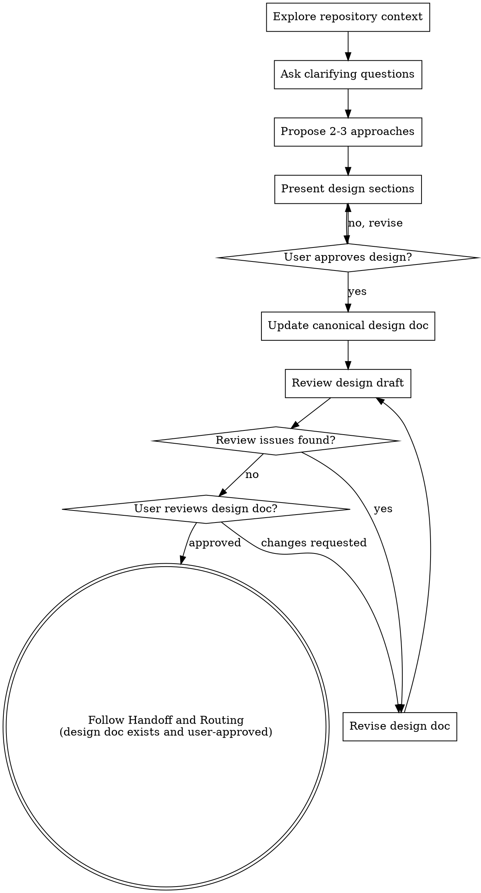

# Brainstorming Ideas Into Designs

Help turn ideas into fully formed designs through natural collaborative dialogue.

Start by understanding the current repository context, then ask questions one at a time to refine the idea. Once you understand what you're building, present the design and get user approval.

## Scope Gate

This skill is required for:
- `phase` work inside a project
- `workstream` work outside a project
- Any task with behavioral/design changes that needs design before planning

This skill is usually not required for standalone non-behavioral tasks (for example docs/chore/mechanical fixes) unless the user asks for design.

<HARD-GATE>
For required work items, do NOT invoke any implementation skill, write any code, scaffold any repository work, or take any implementation action until you have presented a design and the user has approved it.
</HARD-GATE>

## Checklist

You MUST complete these items in order:

1. **Explore repository context** — check files, docs, recent commits
2. **Ask clarifying questions** — one at a time, understand purpose/constraints/success criteria
3. **Propose 2-3 approaches** — with trade-offs and your recommendation
4. **Present design** — in sections scaled to their complexity, get user approval after each section
5. **Update canonical design doc** — save to `scratch/designs/<component-or-feature>.md` (stable path, not time-based)
6. **Design review loop** — run a structured self-review of the design doc (check requirements coverage, ambiguity, risks, and testability); revise until acceptable (max 5 iterations, then surface to human)
7. **User reviews written design doc** — ask user to review the design doc before proceeding
8. **Route to next workflow step** — follow `Handoff and Routing`

## Process Flow

**The terminal state is `Handoff and Routing` only after the design doc exists and the user has approved it.** Route to the next workflow step from there.

## The Process

**Understanding the idea:**

- Check out the current repository state first (files, docs, recent commits)
- Before asking detailed questions, assess scope: if the request describes multiple independent subsystems (e.g., "build a platform with chat, file storage, billing, and analytics"), flag this immediately. Don't spend questions refining details of work that should be split first.
- If the request is too large for one design doc, decompose using this rule: if already in a `project`, split the work into `multiple phases`; if not in a `project`, suggest starting a new `project` for this request. Then brainstorm the first `phase` through the normal design flow. Each phase gets its own design doc -> plan -> implementation cycle.
- For appropriately-scoped `phase/workstream` design work, ask questions one at a time to refine the idea
- Prefer multiple choice questions when possible, but open-ended is fine too
- Only one question per message - if a topic needs more exploration, break it into multiple questions
- Focus on understanding: purpose, constraints, success criteria

**Exploring approaches:**

- Propose 2-3 different approaches with trade-offs
- Present options conversationally with your recommendation and reasoning
- Lead with your recommended option and explain why

**Presenting the design:**

- Once you believe you understand what you're building, present the design
- Scale each section to its complexity: a few sentences if straightforward, up to 200-300 words if nuanced
- Ask after each section whether it looks right so far
- Cover: architecture, components, data flow, error handling, testing
- Be ready to go back and clarify if something doesn't make sense

**Design for isolation and clarity:**

- Break the system into smaller units that each have one clear purpose, communicate through well-defined interfaces, and can be understood and tested independently
- For each unit, you should be able to answer: what does it do, how do you use it, and what does it depend on?
- Can someone understand what a unit does without reading its internals? Can you change the internals without breaking consumers? If not, the boundaries need work.
- Smaller, well-bounded units are also easier for you to work with - you reason better about code you can hold in context at once, and your edits are more reliable when files are focused. When a file grows large, that's often a signal that it's doing too much.

**Working in existing codebases:**

- Explore the current structure before proposing changes. Follow existing patterns.
- Where existing code has problems that affect the work (e.g., a file that's grown too large, unclear boundaries, tangled responsibilities), include targeted improvements as part of the design - the way a good developer improves code they're working in.
- Don't propose unrelated refactoring. Stay focused on what serves the current goal.

## After the Design

**Documentation:**

- Maintain one canonical design document per component/feature at a stable path:
  - `scratch/designs/<component-or-feature>.md`
  - (User preferences for design doc location override this default)
- Do not create date-suffixed design docs as the default workflow
- The canonical design doc should contain the latest approved design only
- Include and maintain a dedicated `Pending Changes` section for approved but unimplemented deltas
- Write clearly and concisely

**Design Review Loop:**
After writing the design document:

1. Run a structured design-doc self-review against requirements, edge cases, and validation strategy
2. If Issues Found: fix and re-run the self-review until acceptable
3. If loop exceeds 5 iterations, surface to human for guidance

**User Review Gate:**
After the design review loop passes, ask the user to review the written design doc before proceeding:

> "Design document written to `<path>`. Please review it and let me know if you want to make any changes before we start writing out the implementation plan."

Wait for the user's response. If they request changes, make them and re-run the design review loop. Only proceed once the user approves.

**Implementation:**

- Follow `Handoff and Routing` to choose the next workflow step.

## Handoff and Routing

After brainstorming is complete (design doc written, reviewed, and user-approved), route by work type:

- `phase/workstream`: invoke `writing-plans` before implementation.
- `single task`: invoke `writing-plans` when a written plan is requested or needed; otherwise proceed directly to implementation using `test-driven-development` for behavior changes and `verification-before-completion` before any completion claim.

In all cases, do not start implementation before this routing decision is made.

## Canonical Design Doc Structure

The canonical component/feature design doc should include:

- `Overview and Scope`
- `Target Design` (the intended steady state)
- `Pending Changes` (approved, unimplemented work needed to reach target)

`Pending Changes` is an active queue, not history. As work lands, implemented items must be removed or updated so this section reflects only remaining deltas.

## Key Principles

- **One question at a time** - Don't overwhelm with multiple questions
- **Multiple choice preferred** - Easier to answer than open-ended when possible
- **YAGNI ruthlessly** - Remove unnecessary features from all designs
- **Explore alternatives** - Always propose 2-3 approaches before settling
- **Incremental validation** - Present design, get approval before moving on
- **Be flexible** - Go back and clarify when something doesn't make sense
